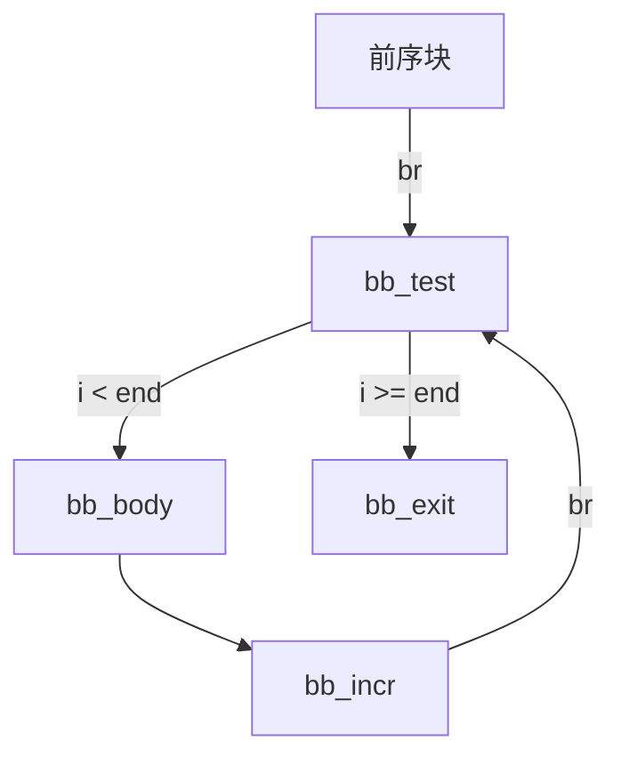

# 实验三：中间表示生成

## 1. 作业概述

本次实验的目标是**扩展 TeaLang 编译器的中间表示（IR）生成阶段**，使编译器能够为新增的语法特性产生正确的 IR。我们将在已有的 AST → IR 生成流程基础上，在类型转换（`conversions.rs`）、类型推断（`type_infer.rs`）和函数体 IR 生成（`function_gen.rs`）中添加对浮点类型、`for` 循环、多维数组或方法调用的支持。

### 1.1 分数构成


| 部分 | 分值 | 说明 |
| --------- | --------- | --------- |
| **三选一** | 60 分 | `for` 循环、`impl` 块与方法、多维数组任选其一完整实现 IR 生成 |
| **必做** | 30 分 | 浮点类型 (`f32`) + 类型转换 (`as`) 的 IR 生成 |
| **Bonus** | 10 分 | 开放任务：自行实现新语法特性的 IR 生成，或对 teac 做出有意义的改进（被合并进主分支）|


### 1.2 特性与测试用例


| 特性 | 对应测试用例 | 涉及改动 |
| --------- | --------- | --------- |
| **浮点类型 (f32)** | `float_basic`, `float_arith`, `float_cmp`, `float_cast`, `float_func` | `types.rs`, `value.rs`, `stmt.rs`, `function.rs`, `conversions.rs`, `type_infer.rs`, `function_gen.rs` |
| **类型转换 (as)**  | `float_cast`, `float_arith`, `float_func` | `type_infer.rs`, `function_gen.rs` |
| **For-In 循环** | `for_basic`, `for_continue`, `for_mixed`, `for_nested`, `for_range` | `type_infer.rs`, `function_gen.rs` |
| **多维数组** | `array_2d_basic`, `array_2d_init`, `array_2d_matmul`, `array_3d`, `array_attention` | `conversions.rs`, `type_infer.rs`, `function_gen.rs` |
| **Impl 块与方法** | `struct_method_basic`, `struct_method_calls`, `struct_method_loop`, `struct_method_namespace`, `struct_method_nested` | `module_gen.rs`, `type_infer.rs`, `function_gen.rs` |


共 20 个测试用例。每个对应 `tests/<name>/<name>.tea` 源程序和 `tests/<name>/<name>.out` 期望输出。我们需要让 `teac --emit ir <file>` 对所选的特性涉及的所有测试文件都能成功输出 IR，且编译运行后的输出与 `.out` 文件一致。

> **注意**：浮点（f32）和类型转换（as）是**必做**的，因此所有同学的测试用例都包含 `float_`* 系列。三选一的特性再额外增加 5 个测试。

### 1.3 交付物

修改以下文件（允许新增文件）：

- `src/ir/types.rs` — IR 类型定义（新增 `Dtype::F32`）
- `src/ir/value.rs` — 操作数定义（新增 `FloatConst`）
- `src/ir/stmt.rs` — IR 语句定义（新增 `FBiOp`、`FCmp`、`SIToFP`、`FPToSI`）
- `src/ir/function.rs` — 函数生成器的 emit 辅助方法
- `src/ir.rs` — `LlvmIdent` 标识符格式化
- `src/ir/gen/conversions.rs` — AST 类型 → IR 类型的转换
- `src/ir/gen/type_infer.rs` — 局部变量前向类型推断
- `src/ir/gen/function_gen.rs` — 函数体 IR 生成
- `src/ir/gen/module_gen.rs` — 模块级 IR 生成（`impl` 块相关）

### 1.4 运行测试

```bash
# 运行全部 teac 主线端到端测试（不包括新增特性的测试）
cargo test

# 运行浮点测试（必做）—— 默认同时检查 AST 解析和 IR 生成
cargo test --features float

# 运行 for 循环测试（三选一）
cargo test --features for-loop

# 运行多维数组测试（三选一）
cargo test --features multi-dim-array

# 运行 impl 方法测试（三选一）
cargo test --features struct-method

# 运行某一个具体的测试
cargo test --features float float_cast

# 只运行 AST 解析检查（跳过 IR 生成，用于实验二阶段）
cargo test --features float,ast-only

# 查看编译器对某个文件的 IR 输出
cargo run -- tests/float_basic/float_basic.tea --emit ir
```

### 1.5 测试原理

每个测试用例依次执行两阶段检查：

**阶段 1：AST 解析**（`test_ast_parse`）

1. `teac --emit ast <file>` 退出码为 0
2. stderr 为空
3. AST 输出非空且包含预期的标识符

**阶段 2：IR 执行**（`test_ir`）

1. `teac --emit ir <file>` 生成 LLVM IR（`.ll` 文件）
2. `clang` 将生成的 `.ll` 与运行时（`tests/std/std.c`）编译链接为可执行文件
3. 运行可执行文件，捕获 stdout 和退出码
4. 与 `.out` 逐行比对（与端到端测试相同的正确性标准）

添加 `--features ast-only` 可以跳过 IR 执行检查，仅验证 AST 解析（用于实验一阶段，IR 尚未实现时）。

## 2. LLVM IR 简介

### 2.1 LLVM 与中间表示

[LLVM](https://llvm.org/) 是一套模块化的编译器基础设施，其核心设计理念是将编译过程分为**前端**（源语言 → IR）和**后端**（IR → 目标机器码）两个独立阶段，中间通过一种统一的中间表示（Intermediate Representation, IR）衔接。

```
源代码  ──前端──▶  LLVM IR  ──后端──▶  机器码
(.tea)            (.ll)              (aarch64/x86)
```

LLVM IR 是一种**强类型**、**低级别**的虚拟指令集，具有以下特征：

- **三地址码（three-address code）**：每条指令最多一个目标寄存器和两个操作数，形如 `%r2 = add i32 %r0, %r1`
- **静态单赋值（SSA）形式**：每个虚拟寄存器（`%r0`, `%r1`, ...）只被赋值一次
- **显式类型标注**：每个值都携带类型信息，如 `i32`、`float`、`ptr`
- **平台无关**：同一份 `.ll` 文件可以被 LLVM 后端编译到 x86、AArch64、RISC-V 等多种目标架构

本实验的目标是让 teac 编译器输出合法的 LLVM IR（`.ll` 文件）。验证时，测试框架调用 `clang` 将生成的 `.ll` 与 C 运行时（提供 `putint` 等 I/O 函数的 `std.c`）一起编译链接为原生可执行文件，然后运行并比对输出。

### 2.2 模块结构

一个 `.ll` 文件对应一个 LLVM **模块（Module）**，模块由以下顶层实体组成：

```llvm
; 1. 结构体类型定义
%Counter = type { i32 }

; 2. 全局变量
@g = dso_local global i32 0, align 4

; 3. 外部函数声明（类似 C 的 extern）
declare void @putint(i32)

; 4. 函数定义
define dso_local i32 @main() {
    ; 函数体 ...
}
```

- **类型定义**以 `%` 开头（如 `%Counter`），定义命名结构体
- **全局变量**以 `@` 开头（如 `@g`），在整个模块可见
- **函数声明**（`declare`）引入外部符号，不含函数体
- **函数定义**（`define`）包含完整的函数体

### 2.3 函数与基本块

一个函数由若干**基本块（Basic Block）**组成。每个基本块是一段顺序执行的指令序列，以**标签（label）**开头、以**终结指令（terminator）**结尾：

```llvm
define i32 @abs(i32 %r0) {
abs:                                    ; 入口基本块，标签与函数名相同
    %r1 = icmp slt i32 %r0, 0          ; 比较 %r0 < 0
    br i1 %r1, label %bb1, label %bb2  ; 终结指令：条件跳转
bb1:                                    ; 基本块 bb1
    %r2 = sub i32 0, %r0               ; 取相反数
    br label %bb3                       ; 终结指令：无条件跳转
bb2:                                    ; 基本块 bb2
    br label %bb3
bb3:                                    ; 基本块 bb3
    %r3 = phi i32 [ %r2, %bb1 ], [ %r0, %bb2 ]
    ret i32 %r3                         ; 终结指令：返回
}
```

基本块内部没有跳转——执行从第一条指令直线到达终结指令。控制流只发生在基本块之间。

LLVM IR 的终结指令有三种：


| 终结指令      | 语法                                | 含义            |
| --------- | --------------------------------- | ------------- |
| `ret`     | `ret i32 %r3` 或 `ret void`        | 函数返回          |
| `br`（条件）  | `br i1 %cond, label %T, label %F` | 根据条件跳转到两个目标之一 |
| `br`（无条件） | `br label %target`                | 无条件跳转         |


### 2.4 类型系统

LLVM IR 是强类型的——每条指令的操作数和结果都有明确的类型。teac 涉及的类型包括：


| LLVM IR 类型 | 含义                | 示例                            |
| ---------- | ----------------- | ----------------------------- |
| `void`     | 无返回值              | `ret void`                    |
| `i1`       | 1 位整数（布尔）         | `icmp` 的结果类型                  |
| `i32`      | 32 位有符号整数         | `add i32 %r0, 1`              |
| `float`    | 32 位 IEEE 754 浮点数 | `fadd float %r0, %r1`         |
| `ptr`      | 不透明指针（LLVM 15+）   | `load i32, ptr %r0`           |
| `[N x T]`  | 包含 N 个 T 类型元素的数组  | `[4 x i32]`、`[3 x [4 x i32]]` |
| `%Name`    | 命名结构体             | `%Counter`（引用 `type` 定义）      |


注意：LLVM 15 以后采用**不透明指针（opaque pointer）**，所有指针统一为 `ptr` 类型，不再区分 `i32`*、`float`* 等。teac 生成的 IR 使用这种新式指针。

**浮点常量**在 LLVM IR 中以 IEEE 754 双精度十六进制格式表示。例如 `1.0` 表示为 `0x3FF0000000000000`，`3.14` 表示为 `0x40091EB860000000`。即使操作类型是 `float`（单精度），常量仍以双精度十六进制写入。

> **注意精度**：LLVM **不会**自动截断双精度常量到单精度。如果为 `float` 类型写入了一个在单精度下无法精确表示的双精度十六进制值（如 `3.14` 的原始双精度编码 `0x40091EB851EB851F`），LLVM 会**直接报错拒绝**，因为将该位模式截断到 f32 会丢失精度。正确的做法是先将 `f64` 值转换为 `f32` 再扩展回 `f64`，确保发出的十六进制常量在单精度下是精确的。例如 `3.14_f64 as f32` 得到 `3.1400001049041748`，其双精度编码正是 `0x40091EB860000000`。

### 2.5 指令集

LLVM IR 的指令可以分为以下几类。下面列出 teac 需要生成的指令：

**算术运算**

整数和浮点使用**不同的指令助记符**：

```llvm
%r2 = add  i32   %r0, %r1     ; 整数加法
%r2 = sub  i32   %r0, %r1     ; 整数减法
%r2 = mul  i32   %r0, %r1     ; 整数乘法
%r2 = sdiv i32   %r0, %r1     ; 有符号整数除法

%r2 = fadd float %r0, %r1     ; 浮点加法
%r2 = fsub float %r0, %r1     ; 浮点减法
%r2 = fmul float %r0, %r1     ; 浮点乘法
%r2 = fdiv float %r0, %r1     ; 浮点除法
```

**比较**

整数使用 `icmp`，浮点使用 `fcmp`，结果类型均为 `i1`：

```llvm
%r2 = icmp eq  i32   %r0, %r1   ; 整数相等
%r2 = icmp slt i32   %r0, %r1   ; 有符号小于

%r2 = fcmp oeq float %r0, %r1   ; 浮点有序相等（ordered equal）
%r2 = fcmp ogt float %r0, %r1   ; 浮点有序大于
```

浮点比较的 `o` 前缀表示 **ordered*。如果任一操作数是 NaN，结果为 `false`。这是最常用的浮点比较语义。

**内存操作**

```llvm
%r0 = alloca i32, align 4              ; 在栈上分配一个 i32 的空间，返回 ptr
store i32 42, ptr %r0, align 4         ; 将值 42 写入 %r0 指向的地址
%r1 = load i32, ptr %r0, align 4       ; 从 %r0 指向的地址读取一个 i32
```

`getelementptr`（GEP）是 LLVM IR 中最复杂的指令，用于计算复合类型（数组、结构体）内元素的地址，**不访问内存**：

```llvm
; 计算数组 arr[2] 的地址：从 [10 x i32]* 得到 i32*
%r1 = getelementptr [10 x i32], ptr %r0, i32 0, i32 2

; 计算结构体第 0 个字段的地址
%r1 = getelementptr %Counter, ptr %r0, i32 0, i32 0
```

GEP 的第一个索引 `i32 0` 是对指针本身的"解引用"（因为 `%r0` 的语义是"指向 `[10 x i32]` 的指针"），第二个索引才是数组/结构体内部的下标。

**类型转换**

```llvm
%r1 = sitofp i32   %r0 to float   ; 有符号整数 → 浮点
%r1 = fptosi float %r0 to i32     ; 浮点 → 有符号整数（截断）
```

**其他**

```llvm
call void @putint(i32 %r0)              ; 无返回值的函数调用
%r1 = call i32 @compute(i32 %r0)        ; 有返回值的函数调用
%r3 = phi i32 [ %r1, %bb1 ], [ %r2, %bb2 ]  ; φ 节点（见下节）
```

### 2.6 SSA 与 φ 节点

LLVM IR 采用 **静态单赋值（Static Single Assignment, SSA）形式：每个虚拟寄存器（`%r0`, `%r1`, ...）在整个函数中只被定义一次**。这个约束使得数据流分析和优化变得简单，但也带来一个问题——当同一个变量在不同控制流路径上被赋予不同的值时，如何在合流点确定使用哪个值？

答案是 **φ（phi）节点**。φ 节点放在基本块的开头，根据控制流的来源选择对应的值：

```llvm
; if (x > 0) result = 1; else result = 0;
main:
    %r0 = icmp sgt i32 %x, 0
    br i1 %r0, label %bb1, label %bb2
bb1:
    br label %bb3
bb2:
    br label %bb3
bb3:
    %result = phi i32 [ 1, %bb1 ], [ 0, %bb2 ]
```

`phi i32 [ 1, %bb1 ], [ 0, %bb2 ]` 的含义：如果控制流从 `%bb1` 到达，取值 `1`；如果从 `%bb2` 到达，取值 `0`。

φ 节点在循环中尤其重要。以一个求和循环为例：

```llvm
; sum = 0; i = 0; while (i < 10) { sum += i; i++; }
entry:
    br label %loop
loop:
    %i   = phi i32 [ 0, %entry ], [ %i_next,   %loop ]
    %sum = phi i32 [ 0, %entry ], [ %sum_next,  %loop ]
    %sum_next = add i32 %sum, %i
    %i_next   = add i32 %i, 1
    %cond = icmp slt i32 %i_next, 10
    br i1 %cond, label %loop, label %exit
exit:
    ret i32 %sum_next
```

循环变量 `%i` 和累加器 `%sum` 都通过 φ 节点在循环头部合并——第一次进入时取初始值（来自 `%entry`），后续迭代取上一轮的更新值（来自 `%loop` 自身）。

### 2.7 内存模型：alloca / load / store

尽管 LLVM IR 是 SSA 形式，但源语言中的**可变局部变量**天然违反"只赋值一次"的约束。LLVM 用 `alloca` / `load` / `store` 三件套解决这个问题：

1. `alloca`：在栈上分配空间，返回一个指针
2. `store`：将值写入指针指向的位置（可执行多次——修改的是内存，不是寄存器）
3. `load`：从内存中读取值到一个新的 SSA 寄存器

例如，源代码 `let mut x: i32 = 1; x = x + 1;` 的 IR：

```llvm
%r0 = alloca i32, align 4         ; 为 x 分配栈空间
store i32 1, ptr %r0, align 4     ; x = 1
%r1 = load i32, ptr %r0, align 4  ; 读取 x 的当前值
%r2 = add i32 %r1, 1              ; x + 1
store i32 %r2, ptr %r0, align 4   ; x = x + 1（写回同一地址）
```

每次修改变量都生成一对 load + store，而不是直接修改寄存器。这样 `%r0`（指针）只被赋值一次，满足 SSA 约束。LLVM 后端的 `mem2reg` 优化 pass 会将这种模式提升为直接使用寄存器和 φ 节点，消除不必要的内存访问。

> teac 的 IR 生成采用了混合策略：简单的临时值（如表达式求值的中间结果）直接使用 SSA 寄存器；而需要取地址或被多次赋值的变量使用 alloca/load/store 模式。循环中被修改的变量在 mem2reg 优化后会转换为 φ 节点形式。

### 2.8 完整示例

以下是一个完整的 `.ll` 文件，展示了上述所有概念的综合运用：

```llvm
declare void @putint(i32)

define dso_local i32 @main() {
main:
    %r0 = alloca i32, align 4
    store i32 10, ptr %r0, align 4
    %r1 = load i32, ptr %r0, align 4
    %r2 = icmp sgt i32 %r1, 5
    br i1 %r2, label %bb1, label %bb2
bb1:
    call void @putint(i32 %r1)
    br label %bb3
bb2:
    call void @putint(i32 0)
    br label %bb3
bb3:
    ret i32 0
}
```

这个程序：分配一个局部变量并赋值 10，比较是否大于 5，根据结果打印不同的值，最后返回 0。可以直接用 `clang test.ll -o test && ./test` 编译运行（前提是提供 `putint` 的实现）。

### 2.9 teac 的 IR 类型（Dtype）

`Dtype` 是 teac 中对 LLVM IR 类型的建模，定义在 `src/ir/types.rs`：

```rust
enum Dtype {
    Void,                              // void
    I1,                                // i1
    I32,                               // i32
    F32,                               // float
    Struct { type_name: String },      // %Name
    Pointer { pointee: Box<Dtype> },   // ptr
    Array { element: Box<Dtype>, length: Option<usize> },  // [N x T]
}
```

`Dtype` 打印为 LLVM IR 风格的文本：`I32` → `i32`，`F32` → `float`，`Array { I32, 4 }` → `[4 x i32]`，`Pointer` → `ptr`。

### 2.10 teac 的操作数（Operand）

`Operand` 表示一条 IR 指令的操作数，定义在 `src/ir/value.rs`：

```rust
enum Operand {
    Const(IntConst),         // 整数常量，如 42
    FloatConst(FloatConst),  // 浮点常量，如 0x40091EB860000000
    Local(Local),            // SSA 局部值，如 %r3
    Global(GlobalRef),       // 全局变量引用，如 @c
}
```

`FloatConst` 内部以 `f64` 存储值，打印时输出 IEEE 754 双精度十六进制表示（`0x{:016X}`），这是 LLVM IR 的标准浮点常量格式（参见 2.4 节）。当 `dtype` 为 `F32` 时，`Display` 实现必须先将 `f64` 值转换为 `f32` 再扩展回 `f64` 来取 bits，确保输出的十六进制常量在单精度下精确可表示（详见 3.5 节"FloatConst 的精度陷阱"）。

### 2.11 teac 的语句（Stmt）

每条 IR 指令是一个 `Stmt`，其核心是 `StmtInner` 枚举。每个变体对应 2.5 节介绍的一条 LLVM IR 指令：

```rust
enum StmtInner {
    Call(..),      // call void @putint(i32 1)
    Load(..),      // %r3 = load float, ptr %r0, align 4
    Phi(..),       // %r33 = phi i32 [ 0, %main ], [ %r8, %bb3 ]
    BiOp(..),      // %r6 = add i32 %r34, %r33
    FBiOp(..),     // %r5 = fdiv float %r4, 0x4000000000000000
    Alloca(..),    // %r0 = alloca float, align 4
    Cmp(..),       // %r3 = icmp slt i32 %r33, 10
    FCmp(..),      // %r5 = fcmp ogt float %r3, %r4
    CJump(..),     // br i1 %r3, label %bb2, label %bb4
    Label(..),     // bb1:
    Store(..),     // store float 0x40091EB860000000, ptr %r0, align 4
    Jump(..),      // br label %bb1
    Gep(..),       // %r7 = getelementptr [3 x [4 x i32]], ptr %r0, i32 0, i32 %r37
    Return(..),    // ret i32 0
    SIToFP(..),    // %r2 = sitofp i32 42 to float
    FPToSI(..),    // %r8 = fptosi float %r7 to i32
}
```

### 2.12 从 AST 到 IR 的流水线

`module_gen.rs` 中的 `IrGenerator::generate()` 分三遍扫描驱动整个降低过程：


| Pass   | 职责                 | 关键代码                                                         |
| ------ | ------------------ | ------------------------------------------------------------ |
| Pass 1 | 处理 `use` 语句，注册外部符号 | `handle_use_stmt`                                            |
| Pass 2 | 注册全局变量、函数签名、结构体定义  | `handle_fn_def` 等                                            |
| Pass 3 | 对每个函数做类型推断 + IR 生成 | `type_infer::infer_function` → `FunctionGenerator::generate` |


Pass 3 是本实验的核心。对每个函数定义，编译器先调用 `type_infer::infer_function` 做前向局部类型推断，得到 `HashMap<String, Dtype>`（每个局部变量的具体类型），然后传入 `FunctionGenerator` 逐条语句生成 IR。

## 3. 浮点类型（f32）与类型转换（as）[必做]

### 3.1 新增 IR 构件

本次实验中，浮点支持涉及以下 IR 层面的新构件：


| 构件              | 定义位置       | 说明                                              |
| --------------- | ---------- | ----------------------------------------------- |
| `Dtype::F32`    | `types.rs` | 浮点类型，打印为 `float`                                |
| `FloatConst`    | `value.rs` | 浮点常量操作数，存储 `f64` 值                              |
| `FloatBinOp`    | `stmt.rs`  | 浮点二元运算符：`FAdd`, `FSub`, `FMul`, `FDiv`          |
| `FCmpPredicate` | `stmt.rs`  | 浮点比较谓词：`OEq`, `ONe`, `OGt`, `OGe`, `OLt`, `OLe` |
| `FBiOpStmt`     | `stmt.rs`  | 浮点二元运算指令                                        |
| `FCmpStmt`      | `stmt.rs`  | 浮点比较指令                                          |
| `SIToFPStmt`    | `stmt.rs`  | `i32` → `float` 转换指令                            |
| `FPToSIStmt`    | `stmt.rs`  | `float` → `i32` 转换指令                            |


这些类型和语句结构需要在 IR 层定义（`types.rs`、`value.rs`、`stmt.rs`），并在 `function.rs` 中提供 emit 辅助方法，最终在 IR **生成**阶段（`function_gen.rs` 等）正确地产生这些指令。可以参考已有的整数类型对应物（如 `BiOpStmt` → `FBiOpStmt`，`CmpStmt` → `FCmpStmt`）的定义和 `Display` 实现来编写浮点版本。

### 3.2 涉及的改动

#### `conversions.rs`：AST 类型到 IR 类型的转换

需要将 `ast::BuiltIn::Float` 正确映射到 `Dtype::F32`。框架中 `From<&ast::TypeSpecifier> for Dtype` 的 `BuiltIn` 分支将所有内建类型一律映射为 `I32`：

```rust
ast::TypeSpecifierInner::BuiltIn(_) => Self::I32,
```

需要拆分成两个匹配臂，分别处理 `Int` 和 `Float`。改动仅一行，但这是整个浮点支持的基础——没有这个映射，所有 `f32` 类型的声明和定义在 IR 层都会被错误地视为 `i32`。

#### `type_infer.rs`：前向类型推断

需要增加以下几项处理：

1. `type_of_expr_unit`：为 `FloatNum` 字面量返回 `Dtype::F32`；为 `As(inner, ty)` 表达式验证操作数类型后返回 `Dtype::from(ty)`（即目标类型决定结果类型）。
2. `type_of_arith_expr`：算术表达式 `left op right` 中，如果任一操作数为 `F32`，则结果类型为 `F32`（而非原来一律返回 `I32`）。这与 IR 生成阶段根据操作数类型选择 `FBiOp` 还是 `BiOp` 的逻辑对应。
3. `check_bool_unit`：比较表达式中需要检查两侧操作数的类型（调用 `type_of_expr_unit`），但不需要强制左右类型一致。类型推断器只验证标识符已定义，具体的 `icmp` vs `fcmp` 选择留给 IR 生成器。

#### `function_gen.rs`：函数体 IR 生成

这是改动量最大的文件，需要处理：

1. **浮点字面量**：在 `handle_expr_unit` 中，将 `ExprUnitInner::FloatNum(v)` 转为 `Operand::FloatConst(FloatConst { dtype: Dtype::F32, val: *v })`。
2. **浮点运算**：在 `handle_arith_biop_expr` 中，若任一操作数为 `f32`，则将另一操作数隐式转换为 `f32`（`sitofp`），然后生成 `FBiOp`（`fadd`/`fsub`/`fmul`/`fdiv`）而非 `BiOp`（`add`/`sub`/`mul`/`sdiv`）。
3. **浮点比较**：在 `handle_com_op_expr` 中，若任一操作数为 `f32`，生成 `FCmp`（`fcmp oeq`/`one`/...）而非 `Cmp`（`icmp eq`/`ne`/...），同样需要对整数侧操作数做隐式转换。
4. **类型转换**：`as` 表达式生成 `SIToFP`（`i32 → f32`）或 `FPToSI`（`f32 → i32`）指令。若源类型和目标类型相同，则直接返回原操作数。
5. **隐式类型强转**：在赋值（`handle_assignment_stmt`）、变量定义（`handle_var_def`）和返回语句（`handle_return_stmt`）处，当值的类型与目标类型不匹配时（如 `f32` 变量赋值一个 `i32` 表达式），需要插入隐式的 `sitofp` / `fptosi`。
6. **函数调用返回值**：`F32` 也是合法的函数返回类型。`handle_fn_call`（表达式位置的函数调用）、隐式 return 等处需要增加对 `Dtype::F32` 的处理。

### 3.3 示例

源程序：

```rust
let x: f32 = 3.14;
let y: f32 = x + 1.0;
let n: i32 = y as i32;
```

生成的 IR：

```llvm
%r0 = alloca float, align 4
store float 0x40091EB860000000, ptr %r0, align 4
%r1 = load float, ptr %r0, align 4
%r2 = fadd float %r1, 0x3FF0000000000000
%r3 = alloca float, align 4
store float %r2, ptr %r3, align 4
%r4 = load float, ptr %r3, align 4
%r5 = fptosi float %r4 to i32
```

关键点：

- 浮点常量 `3.14` 转为 IEEE 754 双精度十六进制 `0x40091EB860000000`
- 加法使用 `fadd` 而非 `add`
- `as i32` 转为 `fptosi float %r4 to i32`

再看反向转换（`i32` → `f32`）：

```rust
let x: i32 = 42;
let f: f32 = x as f32;
```

```llvm
%r2 = sitofp i32 42 to float
%r3 = alloca float, align 4
store float %r2, ptr %r3, align 4
```

### 3.4 测试

```bash
cargo test --features float
```

每个测试生成 IR 后编译运行，与 `.out` 文件比对输出。

### 3.5 实现提示

#### 基础设施层：`Dtype::F32` 的注册

在 `src/ir/types.rs` 中，`Dtype` 枚举需要新增 `F32` 变体，其 `Display` 输出为 `float`（这是 LLVM IR 中单精度浮点的类型名）。同时，`FunctionType::try_from`（从 `ast::FnDecl` 构建函数签名时验证返回类型）的白名单需要从 `Void | I32` 扩展为 `Void | I32 | F32`，否则返回 `f32` 的函数会被拒绝。

#### 基础设施层：emit 辅助函数

`src/ir/function.rs` 中的 `FunctionGenerator` 已有 `emit_biop`、`emit_cmp` 等方法。需要新增对应的浮点版本：

- `emit_fbiop` — 发出 `fadd`/`fsub`/`fmul`/`fdiv`
- `emit_fcmp` — 发出 `fcmp`
- `emit_sitofp` — 发出 `sitofp`（i32 → float）
- `emit_fptosi` — 发出 `fptosi`（float → i32）

这些方法只是简单的 `self.irs.push(Stmt::as_xxx(...))` 封装，但将 IR 构造细节隔离在一处。

#### 隐式类型强转辅助函数

在 `function_gen.rs` 中，多个场景需要在 `i32` 和 `f32` 之间进行隐式转换。建议抽取三个辅助函数来避免重复代码：

```rust
/// 将 i32/i1 操作数提升为 f32（已经是 f32 则不变）
fn coerce_to_f32(&mut self, operand: Operand) -> Operand { ... }

/// 将 f32 操作数截断为 i32（已经是 i32 则不变）
fn coerce_to_i32(&mut self, operand: Operand) -> Operand { ... }

/// 根据目标类型选择 coerce_to_f32 或 coerce_to_i32（类型已匹配则不变）
fn coerce_to(&mut self, operand: Operand, target: &Dtype) -> Operand { ... }
```

这些函数在以下位置被使用：

- `handle_assignment_stmt`：目标指针的 pointee 类型与右值类型不匹配时
- `handle_var_def`：定义 `let x: f32 = <i32 expr>` 时
- `handle_return_stmt`：函数返回类型为 `f32` 但 return 值为 `i32` 时
- `handle_arith_biop_expr`：混合运算 `f32 + i32` 时提升整数侧
- `handle_com_op_expr`：混合比较 `f32 > i32` 时提升整数侧

#### `FloatConst` 的精度陷阱

`FloatConst` 的 `Display` 实现（`src/ir/value.rs`）需要特别注意：当 `dtype` 为 `F32` 时，**不能**直接以 `self.val.to_bits()` 输出十六进制。LLVM 要求 `float` 类型的十六进制常量必须在单精度下精确可表示，否则会拒绝编译。正确的做法是先将 `f64` 值截断为 `f32` 再扩展回 `f64`：

```rust
match &self.dtype {
    Dtype::F32 => {
        let as_f32 = self.val as f32;
        let widened = as_f32 as f64;
        write!(f, "0x{:016X}", widened.to_bits())
    }
    _ => write!(f, "0x{:016X}", self.val.to_bits()),
}
```

这确保了 `3.14` 输出为 `0x40091EB860000000`（f32 精确值）而非 `0x40091EB851EB851F`（f64 精确值但 f32 不精确）。

#### `LlvmIdent` 的 `std::` 前缀处理

`use std;` 语句会将 `std.teah` 中声明的函数以 `std::putint`、`std::getch` 等带前缀的名称注册到函数表中。但 C 运行时（`tests/std/std.c`）导出的符号是不带前缀的 `putint`、`getch`。

`src/ir.rs` 中的 `LlvmIdent`（用于格式化 IR 中的函数名和全局变量名）需要在输出时**去除 `std::` 前缀**，使发出的 IR 符号与 C 运行时匹配。例如 `std::putint` 应输出为 `@putint` 而非 `@"std::putint"`。

## 4. For-In 循环 [三选一]

### 4.1 Lowering 策略

`for i in start..end { body }` 需要被降低为一个包含四个基本块的循环结构：

1. **前序块**：计算 `start` 和 `end` 的值，跳转到测试块
2. **测试块（bb_test）**：用 φ 节点合并循环变量的初始值和每次迭代后的更新值，比较 `i < end`，条件跳转到循环体或出口
3. **循环体（bb_body）**：执行循环体语句
4. **递增块（bb_incr）**：`i = i + 1`，跳回测试块
5. **出口块（bb_exit）**：循环结束后继续执行

控制流图：




`break` 跳转到 `bb_exit`，`continue` 跳转到 `bb_incr`（先递增再回到测试，这与 while 的 `continue` 语义不同）。

### 4.2 φ 节点与 SSA

for 循环中，循环变量 `i` 和循环体内修改的变量都需要通过 φ 节点在测试块入口处合并来自前序块和递增块的值。例如对于 `for i in 0..10 { sum = sum + i; }`，测试块开头需要两个 φ 节点：

```llvm
bb1:
    %r33 = phi i32 [ 0, %main ], [ %r8, %bb3 ]   ; i: 来自前序的0 或 递增后的值
    %r34 = phi i32 [ 0, %main ], [ %r6, %bb3 ]   ; sum: 来自前序的0 或 循环体更新后的值
    %r3 = icmp slt i32 %r33, 10
    br i1 %r3, label %bb2, label %bb4
```

这与 while 循环的降低策略本质相同，teac 的 IR 是 SSA 形式，循环中被修改的变量必须经过 φ 节点合流。

### 4.3 示例

源程序：

```rust
let sum: i32 = 0;
for i in 0..10 {
    sum = sum + i;
}
std::putint(sum);
```

生成的 IR（经 mem2reg 优化后）：

```llvm
main:
    br label %bb1
bb1:
    %r33 = phi i32 [ 0, %main ], [ %r8, %bb3 ]
    %r34 = phi i32 [ 0, %main ], [ %r6, %bb3 ]
    %r3 = icmp slt i32 %r33, 10
    br i1 %r3, label %bb2, label %bb4
bb2:
    %r6 = add i32 %r34, %r33
    br label %bb3
bb3:
    %r8 = add i32 %r33, 1
    br label %bb1
bb4:
    call void @putint(i32 %r34)
```

关键点：

- `bb1` 是测试块，`%r33` 是循环变量 `i` 的 φ 节点
- `bb2` 是循环体，执行 `sum = sum + i`
- `bb3` 是递增块，`i = i + 1`
- `bb4` 是出口块

### 4.4 类型推断

`for i in start..end` 中，循环变量 `i` 的类型由 `start` 和 `end` 表达式决定（在 teac 中固定为 `i32`）。类型推断器需要在处理 for 语句时：

1. 将 `i` 以 `Resolved(I32)` 注册到类型环境中
2. 推断循环体内的变量类型
3. 与 while 循环类似，将循环体的环境合并回循环前的环境

### 4.5 测试

```bash
cargo test --features for-loop
```

每个测试生成 IR 后编译运行，与 `.out` 文件比对输出。

### 4.6 实现提示

#### 参考：while 循环的现有实现

框架中已有完整的 while 循环实现，for 循环可以直接对照着写。

**类型推断**（`type_infer.rs` 中的 `process_while`）：

```rust
fn process_while(&mut self, stmt: &ast::WhileStmt) -> Result<(), Error> {
    self.check_bool_unit(&stmt.bool_unit)?;

    let mut body_ctx = self.fork(self.env.clone());
    body_ctx.process_stmts(&stmt.stmts)?;
    let body_env = body_ctx.env;

    self.merge_env_single(&body_env)?;
    Ok(())
}
```

流程：验证条件表达式 → fork 环境 → 处理循环体 → 合并回外层环境。

**IR 生成**（`function_gen.rs` 中的 `handle_while_stmt`）：

```rust
pub fn handle_while_stmt(&mut self, stmt: &ast::WhileStmt) -> Result<(), Error> {
    let test_label = self.alloc_basic_block();
    let true_label = self.alloc_basic_block();
    let false_label = self.alloc_basic_block();

    self.emit_jump(test_label.clone());               // 前序块 → test

    self.emit_label(test_label.clone());               // test 块
    self.handle_bool_unit(&stmt.bool_unit, true_label.clone(), false_label.clone())?;

    self.emit_label(true_label);                       // body 块
    self.enter_scope();
    for s in &stmt.stmts {
        self.handle_block(s, Some(&test_label), Some(&false_label))?;
    }
    self.exit_scope();
    self.emit_jump(test_label);                        // 回边 → test

    self.emit_label(false_label);                      // exit 块
    Ok(())
}
```

while 是三个基本块（test / body / exit），`continue` → test，`break` → exit。

#### `type_infer.rs`：`process_for`

for 循环的类型推断在 while 的基础上增加两点：

1. **循环变量的绑定**：`for i in start..end` 中，`i` 的类型固定为 `I32`。在处理循环体之前，需要把 `i` 以 `Resolved(I32)` 注入到 **forked 的** 环境中（而不是当前环境——循环变量的作用域仅限于循环体内部）。
2. **循环变量的作用域**：在把循环体的环境合并回外层环境之前，需要从循环体环境中 **移除** 循环变量绑定，防止 `i` 泄漏到外层作用域。

提示：先在 pre-loop 环境中验证 `start` 和 `end` 表达式（确保其中引用的变量已定义），然后 fork 环境、绑定循环变量、处理循环体、移除循环变量、合并环境。

#### `function_gen.rs`：`handle_for_stmt`

for 循环在 while 的三块结构（test / body / exit）基础上增加一个 **incr 块**，形成四块结构。同样使用 alloca/load/store 策略，依赖 `mem2reg` 提升为 SSA 形式。实现步骤：

1. **分配四个基本块**：test、body、incr、exit。
2. **前序块**：计算 `start` 和 `end`，为循环变量和上界各分配一个栈槽（`alloca`），将初始值 `store` 到对应栈槽。用 `enter_scope()` 开启新作用域，将循环变量注册到局部变量表中。
3. **test 块**：`load` 循环变量和上界，`icmp slt` 比较，条件跳转到 body 或 exit。
4. **body 块**：逐条处理循环体语句。`continue` 的目标设为 incr_label（先递增再回到测试），`break` 的目标设为 exit_label。body 末尾无条件跳转到 incr。
5. **incr 块**：`load` 循环变量的当前值，`add i32 %, 1`，`store` 回栈槽，跳转到 test。
6. **exit 块**：`exit_scope()` 退出作用域。

具体示例可参考 4.3 节。

与 while 的关键区别：


|               | while                       | for                                              |
| ------------- | --------------------------- | ------------------------------------------------ |
| 基本块数          | 3（test / body / exit）       | 4（test / body / incr / exit）                     |
| 循环变量          | 无（由用户在循环外手动管理）              | 有（`i`），需要 alloca 栈槽 + `enter_scope`/`exit_scope` |
| `continue` 目标 | test（直接重新判断条件）              | incr（先递增 `i` 再回到 test）                           |
| 条件判断          | `handle_bool_unit`（通用布尔表达式） | 手动 `icmp slt`（`i < end`）                         |
| 回边            | body → test                 | incr → test                                      |


## 5. 多维数组 [三选一]

### 5.1 嵌套的 Dtype

多维数组在 IR 层是**嵌套的 `Dtype::Array`**。例如 `[[i32; 4]; 3]` 对应：

```rust
Dtype::Array {
    element: Box::new(Dtype::Array {
        element: Box::new(Dtype::I32),
        length: Some(4),
    }),
    length: Some(3),
}
```

打印为 `[3 x [4 x i32]]`。这与 LLVM IR 的多维数组表示一致。

### 5.2 多级 GEP

访问多维数组元素需要多级 `getelementptr`（GEP）指令链。每一级 GEP 将指针从外层数组"索引进"一层，得到内层数组的指针，再用下一级 GEP 继续索引。

例如 `mat[i][j]`（`mat: [[i32; 4]; 3]`）的降低：

```llvm
; 第一级 GEP: 从 [3 x [4 x i32]]* 索引到 [4 x i32]*
%r7 = getelementptr [3 x [4 x i32]], ptr %r0, i32 0, i32 %r_i

; 第二级 GEP: 从 [4 x i32]* 索引到 i32*
%r9 = getelementptr [4 x i32], ptr %r7, i32 0, i32 %r_j
```

**每级 GEP 的第一个索引是 0**（"解引用"指针本身），第二个索引是实际的数组下标。

### 5.3 为什么现有代码已经"几乎"支持多维数组

teac 的一维数组 GEP 生成逻辑已经处理了 `identifier[expr]` 形式。对于多维数组 `mat[i][j]`，AST 将其解析为一条**后缀链**：先是 `mat[i]`（产生一个内层数组的指针），然后 `[j]`（对内层数组再索引一次）。

关键在于：每次 `[expr]` 后缀的处理都产生一个 GEP，输入指针的类型从外层数组变为内层数组。如果 `compose_var_decl_dtype` 能正确将 `[[i32; 4]; 3]` 转换为嵌套的 `Dtype::Array`，且 `function_gen.rs` 中的 GEP 生成逻辑能正确处理 `Array { Array { ... } }` 类型的元素类型提取，那么多维数组就能自然地通过递归后缀处理来支持。

因此本特性的核心工作量在于：

1. `conversions.rs`：确保嵌套的 `ast::TypeSpecifierInner::Array` 能递归转换为嵌套的 `Dtype::Array`
2. `type_infer.rs`：在推断包含多维数组的表达式时，正确剥离 `Array` 的外层
3. `function_gen.rs`：确保 GEP 生成在遇到 `Array { element: Array { ... } }` 时能正确提取内层元素类型

### 5.4 示例

源程序：

```rust
let mat: [[i32; 4]; 3];
mat[1][2] = 42;
let v: i32 = mat[1][2];
```

生成的 IR：

```llvm
%r0 = alloca [3 x [4 x i32]], align 4

; 写入 mat[1][2] = 42
%r1 = getelementptr [3 x [4 x i32]], ptr %r0, i32 0, i32 1
%r2 = getelementptr [4 x i32], ptr %r1, i32 0, i32 2
store i32 42, ptr %r2, align 4

; 读取 mat[1][2]
%r3 = getelementptr [3 x [4 x i32]], ptr %r0, i32 0, i32 1
%r4 = getelementptr [4 x i32], ptr %r3, i32 0, i32 2
%r5 = load i32, ptr %r4, align 4
```

### 5.5 测试

```bash
cargo test --features multi-dim-array
```

每个测试生成 IR 后编译运行，与 `.out` 文件比对输出。

## 6. Impl 块与方法 [三选一]

### 6.1 名称修饰（Name Mangling）

TeaLang 中方法通过 `impl` 块定义，在 IR 层面以**名称修饰**的方式与自由函数共存。修饰规则是 `TypeName::method_name`。例如：

```rust
struct Counter { value: i32 }
impl Counter {
    fn get(&self) -> i32 { return self.value; }
    fn add(&mut self, delta: i32) -> i32 { ... }
}
```

在 IR 中产生两个函数定义：

```llvm
define dso_local i32 @"Counter::get"(ptr %r0) { ... }
define dso_local i32 @"Counter::add"(ptr %r0, i32 %r1) { ... }
```

### 6.2 self 参数的处理

`&self` 和 `&mut self` 在 IR 层面统一表示为 `ptr` 参数（指向 `%Counter` 结构体的指针）。在函数签名中，`self` 作为第一个参数，类型是 `Dtype::ptr_to(Dtype::Struct { type_name: "Counter" })`。

在函数体内，`self.value` 被降低为一条 `getelementptr` 指令：

```llvm
%r1 = getelementptr %Counter, ptr %r0, i32 0, i32 0
%r2 = load i32, ptr %r1, align 4
```

`self` 参数（`%r0`）不经过 alloca+store 间接层——它直接注册到局部变量表中，避免额外的 load/store。

### 6.3 模块级处理（Pass 2）

`module_gen.rs` 的 Pass 2 需要处理 `ImplDef` 节点：

1. 遍历 `impl_def.methods`，对每个方法：
  - 用 `TypeName::method_name` 作为修饰后的名称
  - 构造 `FunctionType`，将 `self` 参数替换为 `ptr`
  - 注册到 `Registry` 和 `Module::function_list`

Pass 3 中，方法的 IR 生成与自由函数完全相同，只是名称使用修饰后的版本。

### 6.4 方法调用的解析

调用方有三种语法形式，最终都降低为相同的 IR：

```rust
c[0].get()                  // 点语法
c[0].add_twice(7)           // 带参数的点语法
Counter::get(c[0])          // 显式命名空间语法
```

三种形式都产生：

```llvm
%r0 = getelementptr ..., ptr @c, i32 0, i32 0   ; 获取 c[0] 的指针
%r1 = call i32 @"Counter::get"(ptr %r0)
```

在 `function_gen.rs` 中，方法调用的 IR 生成需要：

1. **确定接收者的指针**：计算 `self` 对应的地址操作数（可能经过数组索引和成员访问）
2. **拼接修饰名称**：从接收者的类型（`Dtype::Struct { type_name }` 或其指针）提取类型名，拼接为 `TypeName::method`
3. **生成 Call 指令**：将接收者指针作为第一个参数传入

对于 `Self::method(self, ...)` 形式（在 impl 块内部调用同类型方法），需要将 `Self::` 替换为当前 impl 的类型名。

### 6.5 示例

源程序：

```rust
struct Counter { value: i32 }
impl Counter {
    fn get(&self) -> i32 { return self.value; }
    fn add(&mut self, delta: i32) -> i32 {
        self.value = self.value + delta;
        return self.value;
    }
}

let c: [Counter; 1];
fn main() -> i32 {
    c[0].value = 10;
    std::putint(c[0].get());
    return c[0].get();
}
```

生成的 IR（节选）：

```llvm
%Counter = type { i32 }

@c = dso_local global [1 x %Counter] zeroinitializer, align 4

define dso_local i32 @"Counter::get"(ptr %r0) {
"Counter::get":
    %r1 = getelementptr %Counter, ptr %r0, i32 0, i32 0
    %r2 = load i32, ptr %r1, align 4
    ret i32 %r2
}

define dso_local i32 @"Counter::add"(ptr %r0, i32 %r1) {
"Counter::add":
    %r3 = getelementptr %Counter, ptr %r0, i32 0, i32 0
    %r4 = getelementptr %Counter, ptr %r0, i32 0, i32 0
    %r5 = load i32, ptr %r4, align 4
    %r7 = add i32 %r5, %r1
    store i32 %r7, ptr %r3, align 4
    %r8 = getelementptr %Counter, ptr %r0, i32 0, i32 0
    %r9 = load i32, ptr %r8, align 4
    ret i32 %r9
}

define dso_local i32 @main() {
main:
    %r0 = getelementptr [1 x %Counter], ptr @c, i32 0, i32 0
    %r1 = getelementptr %Counter, ptr %r0, i32 0, i32 0
    store i32 10, ptr %r1, align 4
    %r2 = getelementptr [1 x %Counter], ptr @c, i32 0, i32 0
    %r3 = call i32 @"Counter::get"(ptr %r2)
    call void @putint(i32 %r3)
    %r8 = getelementptr [1 x %Counter], ptr @c, i32 0, i32 0
    %r9 = call i32 @"Counter::get"(ptr %r8)
    ret i32 %r9
}
```

### 6.6 测试

```bash
cargo test --features struct-method
```

每个测试生成 IR 后编译运行，与 `.out` 文件比对输出。